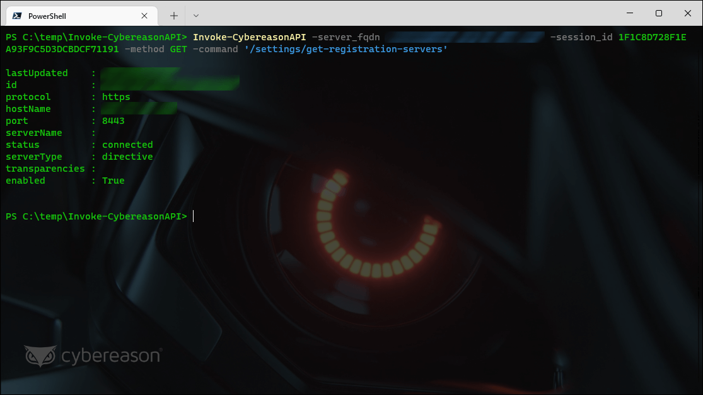

# [Invoke-CybereasonAPI 1.0.0](https://github.com/Cybereason-Fan/Invoke-CybereasonAPI)

### Invokes the API of an on-premise Cybereason management console
> Requires an account on your on-premises Cybereason management console



❗ You must load this script as a "dot sourced" script (see the screenshot above!)
```
. .\Invoke-CybereasonAPI.ps1
```
```
SYNTAX
    Invoke-CybereasonAPI [-server_fqdn] <String> [-session_id] <String> [-method] <String> [-command] <String>
    [[-body] <Hashtable>] [-DebugMode] [<CommonParameters>]


DESCRIPTION
    A framework function to invoke the Cybereason API. Use this to build other tools on or just to experiment with the
    API in a convenient way.
``` 

❓ Not sure where to get the session id? Try [Get-CybereasonCookie](https://github.com/Cybereason-Fan/Get-CybereasonCookie)

## 1.0.0

Initial Release
